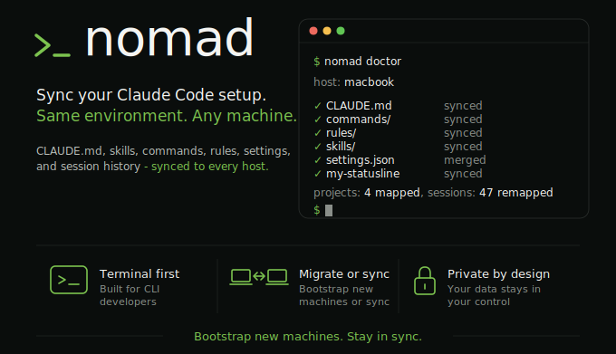

# claude-nomad

[](https://github.com/funkadelic/claude-nomad/actions/workflows/tests.yml)
[](https://github.com/funkadelic/claude-nomad/releases)
[](https://codecov.io/gh/funkadelic/claude-nomad)



Claude Code's state is per-machine. Your `CLAUDE.md`, custom agents, skills, slash commands, settings, and session history live in `~/.claude/` and don't follow you to your laptop, your work machine, or your homelab box.

claude-nomad keeps all of it in sync through a private Git repo you control. `nomad push` on one machine, `nomad pull` on another, and your full setup is there, including past sessions you can resume.

**Who this is for:** anyone running Claude Code on more than one machine. A laptop and a desktop, a Mac and a WSL box, a personal rig and a work machine, or any combination. If you've ever felt the friction of starting fresh on a second machine or copying files around by hand, this is for you.

Two things it does that ad-hoc dotfiles syncing can't:

- **Session history survives path differences.** The same project at `/Users/norm/code/foo` on your Mac and `/home/norm/foo` on Linux gets remapped automatically, so `claude --resume` finds your past conversations on whichever machine you're on.
- **Per-host settings via deep merge.** Shared defaults live in one file; machine-specific overrides (model choice, MCP server URLs, env vars, hooks) live in a per-host file. They're merged on every pull instead of overwriting each other.

## Table of contents

- [Quickstart](#quickstart)
- **Concepts**
  - [How it works (two-repo model)](#how-it-works-two-repo-model)
  - [Repo layout](#repo-layout-what-claude-nomad-looks-like-on-a-configured-host)
  - [What gets synced vs. not](#what-gets-synced-vs-not)
  - [Path remapping](#path-remapping)
  - [Per-host overrides](#per-host-overrides)
  - [What does NOT sync (deliberate trade-offs)](#what-does-not-sync-deliberate-trade-offs)
- **Getting started**
  - [Requirements](#requirements)
  - [Setup](#setup)
  - [Migrating an existing ~/.claude/](#migrating-an-existing-claude)
  - [Upgrading the tool](#upgrading-the-tool)
- **Reference**
  - [Commands](#commands)
  - [Recovery flows](#recovery-flows)
    - [`nomad drop-session <id>`](#nomad-drop-session-id)
    - [Recovery flow: gitleaks FATAL on a session JSONL](#recovery-flow-gitleaks-fatal-on-a-session-jsonl)
    - [`.gitleaks.toml` allowlist policy](#gitleakstoml-allowlist-policy)
  - [Cross-OS resume](#cross-os-resume)
  - [Run tests](#run-tests)

## Quickstart

If you already have a private claude-nomad mirror (see [Setup](#setup) for the one-time bootstrap), adding a new host is three steps:

```bash
npm i -g claude-nomad
```

```bash
# Clone your private mirror so nomad has a repo to sync into.
git clone git@github.com:you/claude-nomad.git ~/claude-nomad

# Add to ~/.zshrc or ~/.bashrc:
export NOMAD_HOST=<your-host-label>

# Optional: developers running against an alternate checkout can point
# nomad at it via NOMAD_REPO. Default is ~/claude-nomad/.
# export NOMAD_REPO=/path/to/repo
```

Then the everyday loop:

```bash
nomad doctor   # confirm setup
nomad pull     # apply config to ~/.claude/
nomad push     # publish local changes (sessions, settings)
```

First-host bootstrap and the safe-migration sequence for a populated `~/.claude/` are in [Setup](#setup) and [Migrating an existing ~/.claude/](#migrating-an-existing-claude).

## How it works (two-repo model)

claude-nomad is a **tool**, not a config store. You maintain a separate **private** repo that holds your actual config (`CLAUDE.md`, agents, skills, settings overrides, session transcripts). The tool's source and your config end up coexisting in one working tree on each host.

```
public funkadelic/claude-nomad          your private you/claude-nomad
  ├── src/         (the CLI)              ├── src/         (copy of the CLI)
  ├── package.json                        ├── package.json
  └── ...                                 ├── ...
                                          ├── shared/      (your config, synced)
                                          │   ├── CLAUDE.md
                                          │   ├── agents/
                                          │   ├── skills/
                                          │   ├── commands/
                                          │   ├── rules/
                                          │   ├── settings.base.json
                                          │   └── projects/
                                          ├── hosts/<hostname>.json
                                          └── path-map.json
```

You bootstrap once by mirror-pushing this public tool repo into a fresh private repo of your own (see [Setup](#setup)), then layer your config on top. Every host afterward installs the CLI (`npm i -g claude-nomad`), clones your private repo to `~/claude-nomad/`, and runs `nomad pull` to sync.

By default the CLI operates on `~/claude-nomad/` (see `REPO_HOME` in `src/config.ts`). Developers working from an alternate checkout can `export NOMAD_REPO=/path/to/repo` to point the CLI at their working tree without symlink gymnastics; `nomad doctor` surfaces an active override via a trailing `(NOMAD_REPO)` annotation on the repo-state line. Empty `NOMAD_REPO` falls through to the default, so a clobbered dotfile variable does not break the CLI.

## Repo layout (what `~/claude-nomad/` looks like on a configured host)

```
~/claude-nomad/
├── src/                      # the CLI (came from the public tool repo)
├── scripts/                  # tool helpers (update.sh; plus any one-shot scripts you add)
├── shared/                   # synced to every machine
│   ├── CLAUDE.md
│   ├── settings.base.json    # baseline settings
│   ├── agents/
│   ├── skills/
│   ├── commands/
│   ├── rules/
│   ├── my-statusline.cjs     # any script you want symlinked into ~/.claude/
│   ├── .gitignore            # defense-in-depth: blocks .claude.json, *.token, *.key, .env
│   └── projects/             # session transcripts under logical names
├── hosts/
│   ├── <your-mac>.json       # patches merged over settings.base.json
│   ├── <your-wsl-host>.json
│   └── <your-nuc>.json
├── path-map.json             # logical project -> per-host absolute path
└── package.json, ... (tool metadata)
```

## What gets synced vs. not

| Category            | Items                                                                                                                                                                                         | Behavior                                                                                                                                                                                   |
| ------------------- | --------------------------------------------------------------------------------------------------------------------------------------------------------------------------------------------- | ------------------------------------------------------------------------------------------------------------------------------------------------------------------------------------------ |
| **Synced**          | `CLAUDE.md`, `agents/`, `skills/`, `commands/`, `rules/`, `my-statusline.cjs`                                                                                                                 | Symlinked into `~/.claude/` from `shared/` (see `SHARED_LINKS` in `src/config.ts`).                                                                                                        |
| **Generated**       | `settings.json`                                                                                                                                                                               | Deep-merge of `settings.base.json` with `hosts/<hostname>.json`. Rewritten on every pull.                                                                                                  |
| **Remapped**        | `projects/` session transcripts                                                                                                                                                               | Copied with path translation per `path-map.json`.                                                                                                                                          |
| **Never synced**    | `~/.claude.json` (OAuth, MCP state), `history.jsonl`, `stats-cache.json`, `todos/`, `shell-snapshots/`, `debug/`, `file-history/`, `plans/`, `session-env/`, `statsig/`, `telemetry/`, `ide/` | Per-host ephemeral state.                                                                                                                                                                  |
| **Auto-rehydrated** | `~/.claude/plugins/cache/<plugin>/...`                                                                                                                                                        | Plugin payloads not synced. Claude Code re-downloads them on first use from the `enabledPlugins` list in the regenerated `settings.json`; no manual `claude plugins install ...` per host. |

> [!NOTE]
> Plugins that depend on host-specific state (external binaries, API keys in env, MCP server URLs) still need that side set up on each host. Put them in `hosts/<host>.json` or the plugin's own per-host config.

For the rationale behind these choices, see [What does NOT sync (deliberate trade-offs)](#what-does-not-sync-deliberate-trade-offs).

## Path remapping

The hard problem: Claude Code stores sessions in `~/.claude/projects/<encoded-path>/` where the encoded path is the absolute path with `/` replaced by `-`. So the same logical project ends up in different directories on each host.

`path-map.json` defines logical names and where the repo lives on each host:

```json
{
  "projects": {
    "ha-acwd": {
      "<your-mac>": "/Users/you/code/ha-acwd",
      "<your-wsl-host>": "/home/you/code/ha-acwd",
      "<your-nuc>": "TBD"
    }
  }
}
```

> [!IMPORTANT]
> The host-label keys must match whatever you set `NOMAD_HOST=` to on each host (see [Setup](#setup)). Mismatched labels silently skip remap, so sessions land in the wrong host's encoded dir.

Use the literal string `"TBD"` for hosts you haven't onboarded yet; `remapPull` skips TBD entries cleanly instead of creating an orphan `~/.claude/projects/TBD/`. Replace each `"TBD"` with the real path when you bring up that host.

On `push`, sessions in `~/.claude/projects/-Users-you-code-ha-acwd/` get copied to `shared/projects/ha-acwd/`. On `pull` on another machine, they get copied to that host's encoded path. `claude --resume` then finds them (see [What does NOT sync (deliberate trade-offs)](#what-does-not-sync-deliberate-trade-offs) for the cross-OS cwd-binding gotcha).

## Per-host overrides

`settings.base.json` holds portable defaults (model, permissions, plugins). `hosts/<NOMAD_HOST>.json` holds machine-specific patches. They're deep-merged on every pull (scalars override, objects merge recursively, arrays replace). Keys that used to be force-marked per-host because they embedded absolute paths (`statusLine.command`, `hooks`) can live in base if you write the commands with `$HOME` (e.g. `"command": "node \"$HOME/.claude/my-statusline.cjs\""`); Claude Code runs them through a shell so shell expansion applies. Reserve per-host files for truly machine-specific values (env, MCP URLs, host-only model overrides).

`shared/settings.base.json`:

```json
{
  "model": "claude-sonnet-4-6",
  "permissions": { "allow": ["Bash(npm run *)", "Bash(git status)"] }
}
```

`hosts/<your-wsl-host>.json`:

```json
{
  "model": "claude-opus-4-7",
  "env": { "OLLAMA_HOST": "http://localhost:11434" }
}
```

Result on that host: opus model, the local Ollama env var, plus the shared permissions array.

> [!CAUTION]
> Never hand-edit `~/.claude/settings.json` on a synced host. It's regenerated on every `nomad pull` from base + host, so your edits will be clobbered. Edit the base or host file in the repo instead.

## What does NOT sync (deliberate trade-offs)

Read these before adopting so you opt in with eyes open.

- **Last-write-wins on conflicts.** Git surfaces them on merge; no field-level JSON merging.
- **Manual push/pull.** No file watcher. Shell hooks recommended.
- **OAuth doesn't sync.** You'll log in once per host. Intentional.
- **Only sessions in `path-map.json` are remapped.** Drive-by sessions on un-mapped paths are left alone.
- **Cross-OS `claude --resume` cwd binding.** Sessions embed the cwd where they were created, so the picker's `cd ... && claude --resume <id>` line fails on a different host. Use `nomad doctor --resume-cmd <id>` for a host-local equivalent (see [Cross-OS resume](#cross-os-resume)). The sidecar approach preserves transcript byte-equality.
- **Empty directories don't survive sync.** Git doesn't track empty dirs; `nomad doctor` reports them as `missing` (benign). Drop a `.gitkeep` to force materialization.

## Requirements

- Node.js 22.22.1 or newer (24 LTS recommended; the npm `engines` field declares the 22.22.1 floor and surfaces a warning on older runtimes — npm only blocks the install when `engine-strict=true` is configured)
- `tsx` (ships as a runtime dependency of the published package; no separate global install required)
- Git
- A **private** GitHub repo (or any Git remote you control)

## Setup

**Why not just fork?** GitHub doesn't let you flip a public fork to private, and your config (especially session transcripts) must stay private. So the bootstrap is a one-time mirror-push into a fresh private repo, not a fork.

> [!WARNING]
> Keep the mirror private. CI workflows under `.github/workflows/` are gated on `${{ !github.event.repository.private }}`, so they skip on any private repo and run only on public ones. Flipping your mirror to public will start firing CI on every `nomad push` against `main`, and your session transcripts (which include conversation content) become world-readable.

Bootstrap (steps 1-2 are once-ever across all hosts; step 3 repeats per host):

```bash
# 1. Create the private repo (or use the GitHub UI). Once, ever.
gh repo create you/claude-nomad --private

# 2. Mirror the public tool into it. This severs the fork relationship,
#    so your repo is independent of upstream. Once, ever.
git clone --bare git@github.com:funkadelic/claude-nomad.git /tmp/cn.git
cd /tmp/cn.git
git push --mirror git@github.com:you/claude-nomad.git
cd .. && rm -rf /tmp/cn.git

# 3. Install the CLI globally and clone your private copy. Repeat on every host.
npm i -g claude-nomad
git clone git@github.com:you/claude-nomad.git ~/claude-nomad
```

`npm i -g claude-nomad` puts a `nomad` binary on your PATH. The bin shim is the existing `src/nomad.ts` entrypoint resolved through tsx (a runtime dependency); no compile step. The npm `engines` field declares the 22.22.1 floor and surfaces a warning on older runtimes; npm only blocks the install when `engine-strict=true` is configured.

On every additional host you only repeat step 3 (the global install is per-host; your private repo already exists on the remote from step 2).

Add to `~/.zshrc` or `~/.bashrc`:

```bash
export NOMAD_HOST=<your-host-label>      # any short, stable label; nomad reads this instead of os.hostname()
```

`NOMAD_HOST` overrides `os.hostname()`, which returns noisy values like `WINDOWS-I5NT6OH` on WSL or `<name>.local` on macOS. Pick a clean label per machine (e.g., `wsl-laptop`, `macbook`, `homelab-nuc`). `nomad doctor` reports the resolved host so you can confirm.

Initialize the repo layout (first host only; subsequent hosts just clone and `nomad pull`). Pick one:

```bash
# Fresh start: scaffold an empty shared/, hosts/, path-map.json skeleton.
nomad init

# Already have ~/.claude/ populated on this host? Capture it as the
# starting point. Stages shared/ and writes hosts/<NOMAD_HOST>.json from
# your current ~/.claude/settings.json. Does NOT touch the originals.
nomad init --snapshot
```

`nomad init` refuses to clobber existing scaffold artifacts, so re-running on a populated repo is a safe no-op (it errors out naming the offender). `nomad pull` against an unscaffolded repo fails fast with `FATAL: repo not initialized; run 'nomad init' to scaffold` instead of silently leaving a half-state.

Edit `path-map.json` to add your logical projects (see [Path remapping](#path-remapping)), then:

```bash
nomad doctor     # read-only state check; reports host, repo state, every check as ✓ (pass) / ✗ (fail) / ⚠︎ (warn)
nomad diff       # preview what nomad pull would change on this host; no lock, no network, no mutation
nomad push       # send current state to the private remote
nomad pull       # apply on another host (or this one after a remote update)
```

`nomad pull --dry-run` is the network-aware twin of `nomad diff`: it acquires the lock and runs `git pull` so you see what the next real pull would do given the latest remote, then exits without mutating.

If the destination host already has populated `~/.claude/{CLAUDE.md, agents/, ...}`, the first `nomad pull` will refuse to overwrite real files. See [Migrating an existing ~/.claude/](#migrating-an-existing-claude) for the safe migration flow.

## Migrating an existing ~/.claude/

If a host already has real files at `~/.claude/{CLAUDE.md, agents/, skills/, ...}` and you want to bring them into the sync, the required sequence is `nomad init --snapshot` → `nomad push` → `nomad pull`:

```bash
# From the host that has the canonical config (the originals are not modified):
nomad init --snapshot   # stages shared/ and writes hosts/<NOMAD_HOST>.json from ~/.claude/
nomad push              # publish the captured state to the private remote

# Then, on this host or any other host that has the private remote checked out:
nomad pull              # materializes the symlinks
```

`nomad pull` is what actually migrates the host. `applySharedLinks` runs a two-pass scan: any pre-existing non-symlink at a `SHARED_LINKS` path whose counterpart exists under `shared/` is renamed into `~/.cache/claude-nomad/backup/<ts>/` first, then the symlink is created. Your originals are preserved under that timestamped backup directory, not deleted. Paths whose `shared/<name>` is absent from the remote are left untouched, so a partial publish does not delete data on the destination host.

If the remote has not been populated yet (you skipped `nomad init --snapshot` and `nomad push`), `nomad pull` is a no-op for SHARED_LINKS: there is nothing on the remote to symlink against, so your local `~/.claude/` files stay in place. The auto-move only triggers once the canonical state is published.

Prefer an explicit tarball rollback and a confirmation prompt before any deletion? Write the equivalent under `scripts/`: tar the `SHARED_LINKS` entries under `~/.claude/` first, copy into `shared/`, prompt, then `nomad pull`. The auto-move path above is the recommended default.

## Upgrading the tool

Two upgrade paths, depending on how you installed:

- **Global install (`npm i -g claude-nomad`):** `npm update -g claude-nomad`. This refreshes only the `nomad` CLI binary on PATH; your private `~/claude-nomad/` repo is untouched.
- **Source-checkout developer workflow:** `nomad update` (run from `~/claude-nomad/`). Topology-aware: detects vanilla vs fork remotes, pulls or merges upstream, and re-runs `npm install` when `package-lock.json` shifted.

Your private repo is not a fork, so GitHub's "Sync fork" UI doesn't apply. The shortcut on a source-checkout host is:

```bash
cd ~/claude-nomad
nomad update
```

`nomad update` (see `cmdUpdate` in `src/commands.update.ts`) detects which layout your `~/claude-nomad/` uses and does the right thing:

- **vanilla** (`origin` points at the public repo): `git pull --ff-only origin main`.
- **fork** (`upstream` points at the public repo, `origin` points at your private mirror): `git fetch upstream`, `git merge upstream/main`, then prompt before pushing the merge to `origin/main`. Pass `--push-origin` to skip the prompt.

Pre-flight checks run before any mutation: `REPO_HOME` exists, topology resolves to `vanilla` or `fork`, current branch is `main`, working tree is clean per `git status --porcelain -z` (override with `--force`), and `--push-origin` is rejected on vanilla topology. After the merge or pull, `nomad update` re-runs `npm install` only when `package-lock.json` actually shifted, then invokes `nomad doctor`. The trailing version-check is non-fatal: `✓` when local matches the latest release, `⚠︎` when behind, an informational `ℹ︎ ... ahead of latest release` line when ahead (e.g. a `-dev` build between releases), and silent on network failures.

Common cases:

```bash
nomad update                  # the usual path
nomad update --dry-run        # detect topology + pre-flight, print would-be git commands only
nomad update --push-origin    # fork topology: push merge to origin/main without prompting
nomad update --force          # proceed past a dirty working tree
```

One-time setup if you're running a fork layout and don't have the `upstream` remote yet:

```bash
git remote add upstream git@github.com:funkadelic/claude-nomad.git
```

`npm run update` still exists as a legacy shim that shells out to `scripts/update.sh`; prefer `nomad update` for new invocations.

To pin to a specific release (`vX.Y.Z`, tagged by release-please) instead of tracking `main`, fetch tags from the public repo and check out the tag (detached HEAD). On vanilla topology that's `origin`; on fork topology that's `upstream` (the private mirror at `origin` does not accumulate upstream release tags). Example: `git fetch upstream --tags && git switch --detach vX.Y.Z` (substitute `origin` for vanilla; use `git checkout vX.Y.Z` on older Git).

## Commands

| Command                          | Description                                                                                                                                                                                                             |
| -------------------------------- | ----------------------------------------------------------------------------------------------------------------------------------------------------------------------------------------------------------------------- |
| `nomad init`                     | Scaffold empty `shared/`, `hosts/`, `path-map.json` on a fresh clone. Refuses to clobber existing scaffold.                                                                                                             |
| `nomad init --snapshot`          | Overlay current host's `~/.claude/` into `shared/` and write `~/.claude/settings.json` verbatim into `hosts/<NOMAD_HOST>.json`. Originals not modified.                                                                 |
| `nomad pull`                     | `git pull --rebase --autostash`, apply symlinks, regenerate `settings.json`, remap session paths. FATAL if scaffold missing.                                                                                            |
| `nomad pull --dry-run`           | Network-aware preview: acquire lock + `git pull --rebase`, print planned changes (symlink moves, `settings.json` diff, transcript overwrites), exit without writing.                                                    |
| `nomad diff`                     | Offline, lockless twin of `pull --dry-run`. No network, no lock. Works against the current local repo state.                                                                                                            |
| `nomad push`                     | Export local sessions to logical names, commit (`chore: sync from <NOMAD_HOST>`), push.                                                                                                                                 |
| `nomad push --dry-run`           | Run pre-push safety checks (gitleaks probe, rebase, remap preview, gitlink scan, allow-list); skip stage, scan, commit, and push.                                                                                       |
| `nomad drop-session <id>`        | Surgically unstage every `shared/projects/*/<id>.jsonl` from the staged tree of `~/claude-nomad/`. Idempotent; the local `~/.claude/projects/<encoded>/<id>.jsonl` is preserved. See [Recovery flows](#recovery-flows). |
| `nomad update`                   | Topology-aware upgrade to the latest upstream. Flags: `--dry-run`, `--force`, `--push-origin`. See [Upgrading the tool](#upgrading-the-tool).                                                                           |
| `nomad doctor`                   | Read-only health check. Each line carries a status glyph (`✓` pass, `✗` fail, `⚠︎` warn); any `✗` sets `process.exitCode = 1` (`⚠︎` does not). Includes an offline-tolerant release-version staleness check.              |
| `nomad doctor --resume-cmd <id>` | Print a host-local `cd ... && claude --resume <id>` line for a session (see [Cross-OS resume](#cross-os-resume)).                                                                                                       |
| `nomad --version`                | Print the installed CLI version as bare semver to stdout; exits 0. Used by the npm-publish smoke test and useful for ad-hoc upgrade checks.                                                                             |

The version-check emits ``⚠︎ version: <local> -> <latest> (run `nomad update`)`` when the local install is behind the latest upstream release, and `✓ version: <local> (latest)` when current. It silently skips on network failures.

Every `nomad pull`, `nomad push`, and `nomad diff` run ends with a single `summary:` line. The status glyph (`✓` green / `⚠︎` yellow / `✗` red / `ℹ︎` dim) carries the severity, mirroring `nomad doctor`'s left-gutter format:

```text
✓ summary: clean
⚠︎ summary: 3 unmapped on pull (run nomad doctor to list)
⚠︎ summary: 2 unmapped on push, 1 collisions (run nomad doctor to list)
```

`✓` lines go to stdout; `⚠︎` and `✗` lines go to stderr. The summary is suppressed when a fatal (`✗`) fires mid-run so you do not see "summary: clean" stacked under an error. Drive-by projects that have no entry in `path-map.json` for this host count as unmapped; the hint points at `nomad doctor`, which lists them by logical name.

## Recovery flows

### `nomad drop-session <id>`

Surgically unstages every `shared/projects/*/<id>.jsonl` from the staged tree of `~/claude-nomad/`. The local `~/.claude/projects/<encoded>/<id>.jsonl` is never touched.

```bash
nomad drop-session <id>
```

Single positional id (the session filename minus `.jsonl`). Anything else (missing id, leading dash, extra arg) exits 1 with a `usage:` line.

For each match in the staged tree, `cmdDropSession` (in `src/commands.drop-session.ts`) classifies the entry as tracked-in-HEAD vs newly-staged and unstages it via `git restore --staged --worktree --` or `git rm --cached -f --` respectively. Idempotent: a second run on the same id sees no matching staged file and exits 0.

Exit codes:

- `0` on any drop, including an idempotent re-run.
- `1` with `✗ no staged session matches <id>` on stderr when no `shared/projects/*/<id>.jsonl` matches.

What it does NOT do: touch the local `~/.claude/projects/<encoded>/<id>.jsonl` file. The local copy is preserved for `claude --resume`, grep recovery, or whatever the user wants. If the underlying secret is real, scrub the local file separately.

### Recovery flow: gitleaks FATAL on a session JSONL

`nomad push` runs `gitleaks protect --staged` before commit. When findings live in a session transcript, the FATAL names every affected session id and the recovery command:

```text
✗ gitleaks detected secrets in 1 session transcript(s).

Session <sid-aaaa>:
  generic-api-key (14), aws-access-token (1)
  Recover with: nomad drop-session <sid-aaaa>

After recovery, re-run nomad push.
```

Two branches from here:

1. **Real secret.** Rotate the credential at its provider (revoke in dashboard, issue replacement), then run `nomad drop-session <sid-aaaa>` to remove the contaminated staged copy, then re-run `nomad push`. To clear the secret from the local transcript as well, edit `~/.claude/projects/<encoded>/<sid-aaaa>.jsonl` to scrub the offending lines; the next `remapPush` copies the cleaned version forward. If the local file is not important to you, leave it alone, the staged-tree drop is enough to publish the push.

2. **False positive.** Add an allowlist regex to `.gitleaks.toml` at the repo root that matches the noise pattern but not real-secret formats, commit it, then re-run `nomad push`. The new allowlist propagates to deploy hosts via `nomad update`.

`nomad drop-session` only acts on the staged tree of `~/claude-nomad/`. Active Claude Code sessions writing to the local file are not disturbed.

### `.gitleaks.toml` allowlist policy

`gitleaks protect` runs against the staged tree on every `nomad push` and can flag structurally-distinguishable tool-output noise as `generic-api-key`. The repo-root `.gitleaks.toml` pre-allows four such patterns so routine pushes are not blocked:

- Sonar issue keys (`AY` prefix + 20+ url-safe chars).
- gitleaks fingerprint format (`<context>:<rule>:<line>` emitted by gitleaks's own reports).
- npm audit advisory hashes (anchored on the JSON shape `"id":"<40..64 hex>"`).
- Coverage-report line-keys (`key=<hex> <path>:<line>`).

The file extends the default gitleaks ruleset, so real high-entropy secrets like `ghp_*`, `sk_live_*`, `xoxb-*`, and `AKIA*` still fire. The allowlist patterns are structurally distinguishable from real-secret formats: a malformed credential cannot match an allowlist regex by accident.

```toml
[extend]
useDefault = true

[allowlist]
description = "claude-nomad: structurally-distinguishable tool-output noise"
regexes = [
    '''AY[A-Za-z0-9_-]{20,}''',
    '''[\w-]+:[\w-]+:\d+''',
    # ...see .gitleaks.toml at the repo root for the full list
]
```

File location: `.gitleaks.toml` at the public repo root (alongside `package.json`). At runtime both `probeGitleaks` (in `src/push-checks.ts`) and `runGitleaksScan` (in `src/push-gitleaks.ts`) conditionally pass `--config <REPO_HOME>/.gitleaks.toml` when the file exists. Hosts that have not yet run `nomad update` (or fresh clones predating the allowlist) fall back silently to the default gitleaks ruleset; there is no warning. Run `nomad update` to receive the latest allowlist.

Editing: amend `.gitleaks.toml` in this repo, open a PR, and merge to `main`. Use TOML literal strings (triple single quotes, `'''regex'''`) for new regex entries so backslashes do not need escaping. Verify the new pattern does not match real-secret formats (`ghp_<36>`, `sk_live_*`, `xoxb-*`, `AKIA[A-Z0-9]{16}`, etc.) before merging. The propagation path is the same as any other repo update: `nomad update` on each host pulls the new file in.

## Cross-OS resume

Claude Code embeds the original `cwd` in each session transcript. When you resume on a different host where that path doesn't exist, the picker prints a `cd <orig-cwd> && claude --resume <id>` line that fails (the source-host path isn't there).

Run this instead:

```bash
eval "$(nomad doctor --resume-cmd <session-id>)"
```

Or pipe through bash:

```bash
nomad doctor --resume-cmd <session-id> | bash
```

`nomad doctor --resume-cmd <id>` reads the `.jsonl`'s recorded `cwd`, reverse-looks up the logical project in `path-map.json`, finds your current host's abspath for that logical, and prints `cd <local-abspath> && claude --resume <id>` to stdout. The command is read-only: it never modifies any transcript byte (Phase 1's sha256 byte-equality invariant is preserved).

If the session isn't mapped on this host, you'll see:

```text
✗ session <id> not mapped on this host; add the logical to path-map.json
```

Other fatal surfaces: missing `~/.claude/projects/`, session id absent from every encoded dir, no `cwd` field anywhere in the transcript, missing `path-map.json`, recorded cwd not present in any logical's host map. All errors go to stderr prefixed with the red `✗` fail glyph; the success line goes to stdout as a bare shell command (no glyph) so `eval` works.

## Run tests

```bash
npm install
npx vitest run
```
