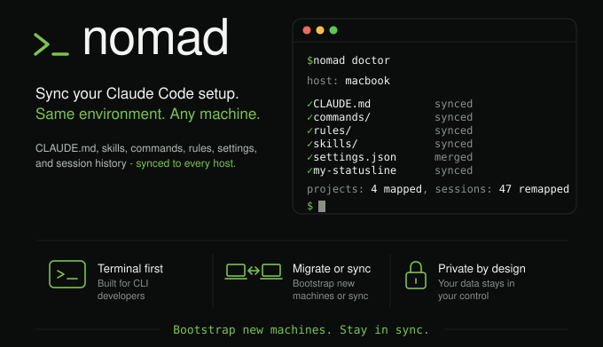

# claude-nomad

[](https://github.com/funkadelic/claude-nomad/actions/workflows/tests.yml)
[](https://github.com/funkadelic/claude-nomad/actions/workflows/codeql.yml)
[](https://codecov.io/gh/funkadelic/claude-nomad)
[](https://www.npmjs.com/package/claude-nomad)
[](https://www.npmjs.com/package/claude-nomad)
[](LICENSE)



**Your entire Claude Code setup, on every machine. History included, every push secret-scanned.**

Open Claude Code on a second machine and it is a blank slate: none of your custom skills, slash
commands, tuned settings, or past conversations. **claude-nomad** keeps all of it in sync through a
private Git repo you control. Run `nomad sync` on any machine and everything is there, conversations
included; it pulls in your latest config first, then publishes your local changes, so you never have
to remember which one to run first.

Not dotfiles, not rsync. **claude-nomad** understands Claude Code's state, so your session history
survives different file paths and your secrets never ride along.

**Full documentation: <https://funkadelic.github.io/claude-nomad/>**

## Features

- **Sessions follow you across machines.** Start a conversation on your desktop, run
  `claude --resume` on your laptop, and it is there. claude-nomad rewrites the machine-specific file
  paths Claude Code embeds in every transcript, so history survives projects living at different
  paths on different hosts.
- **One shared setup, per-machine exceptions.** Your own skills, slash commands, rules, and your
  `CLAUDE.md` live in one place and follow you everywhere. `hooks/` and `agents/` are installed
  per-host by `@opengsd/gsd-core` via npm and are not synced (syncing them caused version-skew
  churn). Skills sync as a filtered copy: your own skills travel, `gsd-*` skills are excluded (see
  `SHARED_LINKS` and `src/skills-sync.ts` in `src/config.ts`). Settings merge a shared base with a
  per-host override, so one machine can run a different model or MCP URL without forking the rest.
  GSD-owned hook entries (scripts whose basename starts with `gsd-`) are filtered out of the
  generated `~/.claude/settings.json` during pull and stripped from `shared/settings.base.json` on
  the next push; GSD reinstalls the correct per-host hook set itself. A non-gsd hook you add to your
  live settings syncs normally via `nomad capture-settings`.
- **Every push is secret-scanned.** Only an explicit allow-list of paths ever leaves the machine,
  credentials never sync, and gitleaks scans the exact files about to be published. The push aborts
  on any hit, with an interactive menu to redact, allow, or drop the finding. Always publish through
  `nomad push`: the sync repo is an ordinary Git repo, so a manual `git push` from it skips the scan
  entirely and can leak a secret that `nomad push` would have caught. Steady-state pushes scan only
  the transcripts that changed since the last successful push (incremental); a cold start, a
  gitleaks version change, a config file change, or `--full-scan` forces a full rescan.
  `nomad doctor --check-shared` also runs a read-only advisory over memory notes and skill files
  already synced to the repo, flagging (but never blocking on) a secret that already made it through
  in a past push; the fix is the same interactive Redact step `nomad push` offers.
- **Preview before you trust it.** `nomad diff` shows offline what a pull would change (gsd-owned
  hook churn is filtered the same as on pull, so the preview matches what a real pull writes), and
  `--dry-run` on pull and push prints the plan without writing anything.
- **One command tells you what is wrong.** `nomad doctor` is a read-only health check: wedged sync
  repo, broken hook references, hooks that would crash on session start because of a missing
  `--preserve-symlinks-main` flag, version drift, oversized backup cache, missing git committer
  identity in the sync repo (a push fails at commit time without one), path-map entries whose local
  project folder no longer exists on this machine, a multi-host repo where this machine's
  hostname-derived key matches no `hosts/<HOST>.json` or path-map entry (a sign `NOMAD_HOST` is
  unset here, so per-host settings and session sync will not line up with the other hosts), synced
  skills with local edits that differ from the shared copy, a native Windows shared-config copy that
  has drifted from the repo's copy (a warning, not a failure), and settings drift in both
  directions: keys present in the repo merge but absent from your live `settings.json` (behind; the
  next `nomad pull` will restore them, fix: `nomad pull`) and keys present locally but not yet in
  the repo (ahead; local-only additions, fix: `nomad capture-settings`). Each issue includes a fix
  hint. By default the report is compact: it shows only checks that need action plus a one-line
  verdict. Add `--verbose` (or `--all` / `-v`) to see the full per-check tree, including everything
  that passed.
- **Self-healing sync.** Every overwrite is backed up first, and `nomad pull --force-remote`
  recovers two kinds of stuck sync repo: a repo stuck mid-rebase or mid-merge (aborts the operation,
  parks stranded work on a branch, refuses if shared config is at risk), and a repo where the rebase
  was interrupted but the git index was left with unmerged entries and no active operation (clears
  the index via `git reset --mixed HEAD`, surfaces any orphaned stash entry left by the interrupted
  autostash, never discards working-tree edits).
- **Easy off.** `nomad eject` replaces every managed `~/.claude/` symlink with a real copy in one
  step, so your setup keeps working after you delete the sync checkout and uninstall the CLI.

See the [full feature tour](https://funkadelic.github.io/claude-nomad/features/) for the rest:
opt-in per-project sync, transcript redaction, backup pruning, and more.

## Quickstart

nomad works with two directories, and the difference is the one thing worth learning up front:

- **`~/claude-nomad/`** is your private sync repo. This is the one you edit.
- **`~/.claude/`** is Claude Code's live config. nomad regenerates it on every `pull`.

Edit the repo, never the live config. In particular, never hand-edit `~/.claude/settings.json`: it
is rebuilt from the repo on every pull and your changes are lost. Change `shared/settings.base.json`
(or `hosts/<HOST>.json`) in the repo instead, or run `nomad capture-settings` to pull local changes
back into the repo (see [Changing settings](#changing-settings)).

**First host** (once, ever):

```bash
# 1. Install the CLI.
$ npm i -g claude-nomad

# 2. Create your private sync repo and scaffold it. If you already have a
#    ~/.claude/ worth keeping, init offers to seed the repo from it.
$ nomad init                   # prompts for a repo name (default: claude-nomad-config)
$ nomad init --repo my-config  # set the repo name without the prompt
$ nomad init --snapshot        # seed from existing ~/.claude/ without being asked

# 3. Add a stable host label to ~/.zshrc or ~/.bashrc, then reload.
export NOMAD_HOST=<your-host-label>

# 4. Publish the scaffold to your private repo.
$ nomad push
```

**Each additional host:**

```bash
$ npm i -g claude-nomad
$ gh repo clone <your-username>/claude-nomad-config ~/claude-nomad
export NOMAD_HOST=<your-host-label>   # add to ~/.zshrc or ~/.bashrc
$ nomad pull
```

### Windows

claude-nomad runs natively on Windows (PowerShell or cmd), and WSL2 works too. The everyday loop is
the same either way; the difference is under the hood.

On macOS, Linux, and WSL2, claude-nomad symlinks your shared config into `~/.claude/`, so there is
only ever one file: the one in your sync repo. Native Windows cannot use symlinks, because creating
one there needs Developer Mode or admin rights, so claude-nomad keeps a real copy there instead.
That leaves two files to keep in step, and claude-nomad does it for you: `nomad pull` and
`nomad sync` both copy your edits into the repo before they fetch, so an unpublished edit is never
overwritten. Enabling Developer Mode does not change this; copies are used on every native Windows
host either way.

Two things come from native Windows specifically, both covered in the bullets below: a
`.gitleaksignore` allow entry may not travel to a macOS, Linux, or WSL2 host, and deep session paths
can hit the native Windows 260-character path limit.

The native Windows steps are the same as above with a couple of PowerShell-specific swaps:

```powershell
# 1. Install the CLI.
> npm i -g claude-nomad

# 2. Create your private sync repo and scaffold it.
> nomad init

# 3. Add a stable host label. PowerShell has no ~/.bashrc equivalent, so set it
#    as a persistent user environment variable instead, then restart your
#    terminal so the new value is picked up.
> [System.Environment]::SetEnvironmentVariable('NOMAD_HOST', '<your-host-label>', 'User')
#    Using cmd instead of PowerShell? The equivalent one-liner is:
#    setx NOMAD_HOST <your-host-label>

# 4. Publish the scaffold to your private repo.
> nomad push
```

A few native Windows specifics worth knowing. WSL2 behaves like Linux, so the copy-sync and
path-length items below do not apply to it; the `.gitleaksignore` one can still reach it, from the
other side:

- **Installing gh:** `winget install GitHub.cli` (or `scoop install gh`), then `gh auth login`.
  Needed before `nomad init` on the first host; later hosts only clone with it.
- **Installing gitleaks:** `winget install gitleaks.gitleaks` (or `scoop install gitleaks` if you
  use Scoop). `nomad doctor` prints the same hint whenever gitleaks is missing from PATH.
- **Shared config is copied, not symlinked.** On macOS and Linux, files like `CLAUDE.md` and your
  skills live in the sync repo and are symlinked into `~/.claude/`, so there is one source of truth
  on disk. Creating a symlink on native Windows needs Developer Mode or admin rights, so there these
  are real copies instead, whether or not you have Developer Mode enabled. WSL2 is unaffected and
  behaves like Linux. What this means for you: nothing extra. On native Windows both `nomad pull`
  and `nomad sync` mirror your local copies into the repo before they fetch, so an unpublished edit
  is captured rather than reverted. A file you delete from a shared directory is handled the same
  way: it is removed from the sync repo by the next pull, exactly as deleting inside a symlinked
  directory already removes it on macOS or Linux. The removal is left uncommitted, so it publishes
  on your next push and passes the same secret scan as everything else, and the file is snapshotted
  to the backup dir first. The safety rule behind this: nomad only removes a file it has a record of
  having given this machine, so a repo file this machine has never synced is never touched. That
  record is also why the first pull after you upgrade to this version is an exception: there is
  nothing to compare against yet, so a deletion made before that pull comes back once, and deleting
  it again sticks. If a file you created has the same name as one another machine just created, the
  pull stops before it changes anything and tells you which file under `~/.claude/` to move or
  rename, with the two ways to finish. Nothing is lost either way: your file stays exactly as you
  left it and the update simply waits for the next pull. The one command that deliberately takes the
  repo's version is `nomad pull --force-remote`, which is what that flag is for; the copy it
  replaces is snapshotted to the backup dir first. This is the same behavior claude-nomad's
  `skills/` sync already has on every platform.
- **A `.gitleaksignore` allow entry may not travel across hosts.** gitleaks fingerprints each
  finding using the file path exactly as it saw it: backslashes on native Windows, forward slashes
  on macOS/Linux/WSL2. If you allow a finding with `nomad push --allow` (or `nomad allow`) on native
  Windows, the identical finding can reappear as "new" the first time it is scanned from a macOS,
  Linux, or WSL2 host, and the same happens in reverse. This is a known gitleaks limitation, not a
  claude-nomad bug; just allow it again from the other host.
- **Line endings stay put.** A fresh `nomad init` writes a `.gitattributes` with `* -text`, so Git
  never converts line endings between hosts. If you are joining a sync repo created before this file
  existed, add that one line from any host (or watch for the `nomad doctor` warning that nudges
  you), otherwise a native Windows checkout with the common `core.autocrlf=true` Git default would
  rewrite every text file's line endings, and every host would then see the whole tree as
  permanently changed.

Everyday loop on any host:

```bash
$ nomad doctor   # confirm setup
$ nomad sync     # pull config, then publish local changes, in one step
```

`nomad sync` is the command to reach for day to day: it always pulls first (so changes from your
other machines land before anything is pushed, and work that exists only on this machine is kept,
not deleted) and then pushes, under one lock, so there is no ordering to remember. Output is compact
by default: a run prints only a short Sync summary, not the full status tree; pass
`nomad sync --verbose` (or `--all` / `-v`) to see the full tree. `nomad pull` and `nomad push` are
still available as lower-level commands for cases `sync` does not cover: recovering a wedged repo
with `nomad pull --force-remote`, or resolving a detected secret without the interactive menu via
`nomad push --redact-all` / `--allow` / `--allow-all` (see [Changing settings](#changing-settings)
and [Recovery flows](https://funkadelic.github.io/claude-nomad/recovery/)). The
[FAQ](https://funkadelic.github.io/claude-nomad/faq/) covers what `sync` does under the hood and the
push/pull order it enforces.

### Make your sessions follow you

Session history only syncs for projects you list in `path-map.json`, and a fresh `init` starts with
none, so no sessions sync until you add a mapping. Each entry maps a logical project name to the
absolute path it lives at on each host:

```json
{
  "projects": {
    "my-app": {
      "laptop": "/Users/you/code/my-app",
      "desktop": "/home/you/projects/my-app"
    }
  }
}
```

The host keys (`laptop`, `desktop`) are the same labels you set in `NOMAD_HOST` on each machine.
After editing `path-map.json`, `nomad push` publishes the matching sessions and `nomad pull` on
another host copies them into place, rewriting the embedded file paths so `claude --resume` finds
them at that host's path.

### Changing settings

There are two ways a settings change reaches the repo, and the right one depends on where you made
it:

- **You are deciding the change:** edit `shared/settings.base.json` (shared by every host) or
  `hosts/<HOST>.json` (one machine only) in the repo, then `nomad push`.
- **Something else already wrote it** (Claude Code or a tool added keys to your live
  `~/.claude/settings.json`): run `nomad capture-settings` to promote those keys into the repo
  before the next `nomad pull` overwrites them. Add `--host` to land machine-specific values (such
  as absolute paths) in `hosts/<HOST>.json` instead of the shared base.

During `nomad push` and `nomad pull`, long-running steps (rebase, secret scan, git push, session
sync) show an animated progress indicator on an interactive terminal so the CLI does not look hung.
In CI and when output is piped, only plain text lines are printed, with no ANSI control codes, so
log output remains grep-stable.

When `nomad push` detects a potential secret, it drops into an interactive menu (TTY) or aborts with
a recovery hint (non-TTY/CI). Three non-interactive recovery paths are available without the menu:

- `nomad push --full-scan` -- ignore the per-host push manifest and rescan all transcripts, then
  rewrite the manifest on success. Use this after upgrading gitleaks, after editing a gitleaks
  config file, or whenever you want to be certain nothing slipped through an incremental scan.
  Composes freely with `--dry-run` and all resolution modes.
- `nomad push --redact-all` -- scrub every finding from the local transcript in place, then push.
  All-or-nothing: if any finding cannot be redacted (an active session, or one that does not map to
  a synced transcript), nothing is changed and the push stops so you can handle those sessions.
- `nomad push --allow <rule>` -- record findings matching one gitleaks rule id as false positives
  (appends their fingerprints to `.gitleaksignore`), then re-scan and push.
- `nomad push --allow-all` -- record every current finding as a false positive, then re-scan and
  push.
- `nomad allow <fingerprint>...` -- pre-record specific fingerprints in `.gitleaksignore` without
  going through a push cycle.

All allow paths always re-scan after writing the allowlist; a surviving finding still aborts the
push. See [Recovery flows](https://funkadelic.github.io/claude-nomad/recovery/) for the full
decision tree.

If a previous `nomad pull` left the sync repo in a stuck state, run `nomad pull --force-remote` to
auto-recover. It handles two cases: a repo stuck mid-rebase or mid-merge (aborts the in-progress
operation, parks stranded commits on a `nomad/stranded-<ts>` branch, resets to `origin/main`, then
re-pulls; refuses if stranded or dirty tracked changes touch synced config), and a repo where the
rebase was torn down but the git index still has unmerged entries with no active rebase or merge in
progress (clears the stuck index via `git reset --mixed HEAD`, preserving working-tree edits,
surfaces any orphaned autostash entry, then re-pulls; stops after the index repair if any conflicted
file still carries conflict markers, so they are never copied into your live config). Run
`nomad doctor` first if you are unsure which state you are in; the Repository section names the
specific problem and points at the right fix.

If an external tool (such as Claude Code or GSD) wrote new keys into your `~/.claude/settings.json`
that are not yet in your shared repo, run `nomad capture-settings` to promote them before the next
`nomad pull` overwrites them. With `--host`, the keys land in `hosts/<NOMAD_HOST>.json` instead of
`shared/settings.base.json` (useful for machine-specific values such as absolute paths). `--dry-run`
shows what would be written without touching anything. Before it writes, `capture-settings` shows
the destination and the keys and asks you to confirm; pass `--yes` (or `-y`) to skip the prompt,
which is required when running without an interactive terminal. `nomad push` also warns when it
detects ahead-drift so you have a prompt to act before the push completes.

## Claude Code plugin

An optional companion plugin puts nomad one slash away inside Claude Code and warns you at session
start when your synced setup has drifted. It is a thin layer over the CLI: install `claude-nomad`
first (minimum version `>= 0.35.0`), then add the plugin.

```text
/plugin marketplace add funkadelic/claude-nomad
/plugin install nomad@claude-nomad
```

It adds `/nomad:sync` (preview only), `/nomad:pull`, `/nomad:diff`, `/nomad:push` (preview only),
`/nomad:doctor`, and `/nomad:clean`, plus a session-start drift check. The plugin versions
independently from the CLI, but requires nomad `>= 0.35.0` because it calls recent subcommands
(`nomad diff`, `nomad clean --backups`) and reads the doctor command's status output. See the
[plugin guide](https://funkadelic.github.io/claude-nomad/plugin/) for details.

## Requirements

- Node.js 22.22.1 or newer (24 LTS recommended)
- Git
- [`gitleaks`](https://github.com/gitleaks/gitleaks) (required for `nomad push`)
- `gh` ([GitHub CLI](https://cli.github.com/)), required by `nomad init`

Works on macOS, Linux (including WSL2), and native Windows (PowerShell or cmd). See
[Windows](#windows) above for the native Windows equivalents of the install and host-label steps,
the copy-sync trade-off, and the `.gitleaksignore` cross-host caveat.

**Optional:** [curl](https://curl.se/) or [wget](https://www.gnu.org/software/wget/) for the
version-staleness check and `nomad doctor --check-schema`. The CLI works without them. The opt-in
`nomad doctor --check-remote` flag reads the locally-cached `origin/main` remote-tracking ref (no
curl or wget needed) and verifies that `shared/` and a valid `path-map.json` are present there; it
skips with a `⚠︎` when the ref is unavailable, and is non-fatal in all cases.

## Exit codes

Every `nomad` subcommand exits with one of a small set of codes, so a script or cron wrapper can
branch on `$?` without parsing stderr text.

| Code | Name            | Meaning                                                                              |
| ---- | --------------- | ------------------------------------------------------------------------------------ |
| 0    | Success         | Completed successfully.                                                              |
| 1    | Generic failure | Unclassified failure; the default for any error not covered below.                   |
| 2    | Usage           | Bad argv: an unknown subcommand, an unknown flag, or a malformed flag value.         |
| 4    | Conflict        | The sync repo is wedged (e.g. an unresolved rebase) and needs manual git resolution. |
| 5    | Leak blocked    | gitleaks confirmed a secret in the staged tree and the push was aborted.             |
| 130  | Interrupted     | You pressed Ctrl+C at an interactive prompt, so nomad stopped without finishing.     |

A run skipped because another nomad process already holds the lock also exits 0: this is an
intentional no-op skip, not a failure, so a backgrounded shell-rc or cron invocation never raises a
false alarm from a concurrent run. Value `3` is reserved for future use.

## Crash reports

If `nomad` ever hits an unexpected bug, it no longer dumps a raw stack trace at you. Instead it
prints a short "this looks like a bug" banner (with a link to the issue tracker) and writes a small
report you can attach to a bug report if you choose. The exit code is unchanged: an unexpected crash
exits `1`, and a documented failure still exits with its own code from the table above. A prompt you
cancel yourself is not a crash: it exits `130` and writes no report.

What this means for you:

- **The report stays on your machine.** It is written to `~/.cache/claude-nomad/crash/` and nothing
  is ever uploaded anywhere. The file just sits there until you decide to share it or delete it.
- **The saved report is scrubbed twice.** First a structural pass rewrites your home directory to
  `~` and your hostname to a placeholder (absolute paths are personal information a secret scanner
  would not catch), and redacts credential-shaped tokens it recognizes (GitHub, GitLab, Slack, and
  AWS keys, plus any credentials embedded in a URL); this pass needs no external tools. Then a
  best-effort secret scan runs the same gitleaks-based redaction nomad already uses for session
  transcripts. The secret scan works on a temporary, owner-only (`0o600`) copy that already has the
  structural scrub applied; that scratch file is deleted immediately after the scan, and only the
  fully-redacted report is kept.
- **It degrades safely without gitleaks.** If gitleaks is not installed, the structural scrub and
  the credential-shape backstop still run and the report is still written, with a one-line note that
  the deeper secret scan did not run. The backstop catches common token shapes but not everything,
  so still give the report a glance before posting it publicly.
- **It is small and bounded.** The report contains only the nomad version, the command you ran
  (bounded, and including any flag values you typed), the error name and message, a trimmed stack,
  your platform, the Node.js version, and a timestamp. It never includes an environment dump or the
  contents of any file.
- **The directory manages itself.** Only the most recent reports are kept; older ones are pruned
  automatically on the next crash. There is no `nomad clean` flag for the crash directory, by
  design: it self-manages.

## Learn more

- [How it works](https://funkadelic.github.io/claude-nomad/how-it-works/) -- path remapping,
  settings merge, what syncs and what doesn't
- [GSD-aware sync](https://funkadelic.github.io/claude-nomad/gsd-aware-sync/) -- what nomad does for
  GSD users out of the box
- [Setup and migration](https://funkadelic.github.io/claude-nomad/quickstart/) -- full setup
  walkthrough, migrating an existing `~/.claude/`
- [Recipes](https://funkadelic.github.io/claude-nomad/recipes/) -- copy-pasteable example configs
  for common setups, from scratch to cross-OS remapping and GSD integration
- [Commands reference](https://funkadelic.github.io/claude-nomad/commands/) -- all CLI flags
- [Claude Code plugin](https://funkadelic.github.io/claude-nomad/plugin/) -- /nomad slash commands
  and the session-start drift check
- [Recovery flows](https://funkadelic.github.io/claude-nomad/recovery/) -- backups, drop-session,
  redact, gitleaks allowlist, non-interactive allow
- [FAQ](https://funkadelic.github.io/claude-nomad/faq/) -- common questions, like the right
  push/pull order when both sides have changes
- [Contributing](https://funkadelic.github.io/claude-nomad/contributing/)
- [Security policy](https://funkadelic.github.io/claude-nomad/security/)
